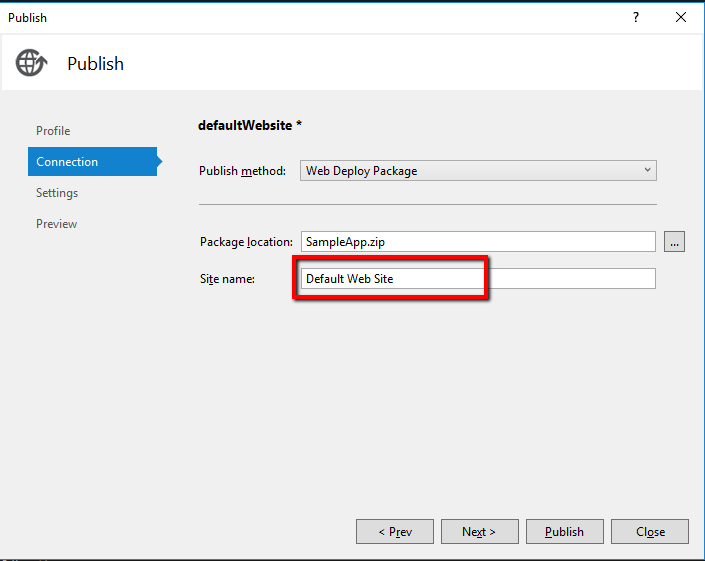
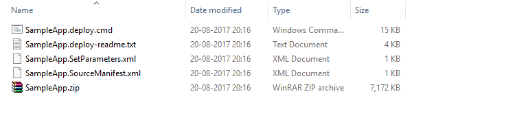
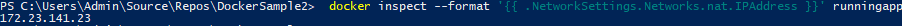
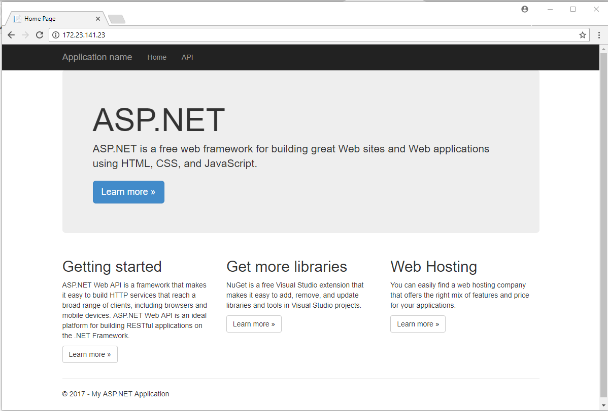

# Sample Docker .Net Application
For initial installation and hello world docker sample use the link below

https://docs.microsoft.com/en-us/virtualization/windowscontainers/quick-start/quick-start-windows-10

We will be only look into deploying .Net application into Docker

#### Pre-requisites

1. High Speed Internet to download docker images
2. Follow the quick start example given above. Install Docker and test the hello world docker
3. Clone this application.
4. Knowledge in .Net Web API

### Build Your Web API App.

1. Create a new Web api project. You can use the link [here](https://docs.microsoft.com/en-us/aspnet/web-api/overview/getting-started-with-aspnet-web-api/tutorial-your-first-web-api) for detailed example. I recommend default webapi app is enough
2. Publish the file using Web Deploy package
3. Make sure you set **Default Web Site** in the Sitename

   

### About Current DockerFile

We will look into the scripts in the docker file one by one. I have used a sample web api application and created package out of the web api application. For simplicity purpose we will directly use the package in zip file format.

This command will download asp.net from the docker hub which is uploaded by microsoft.

    FROM microsoft/aspnet

This command creates a directory called install and add the msi file to folder in docker container. This is needed to run msdeploy command. 

    RUN mkdir c:\install
    ADD WebDeploy_2_10_amd64_en-US.msi /install/WebDeploy_2_10_amd64_en-US.msi

Below command is powershell script to fix the permission issues. This is added to docker container.

    ADD fixAcls.ps1 /SampleApp/fixAcls.ps1

Below command add all the files needed to deploy the web app/api application.

    ADD SampleApp/SampleApp.zip /SampleApp/SampleApp.zip
    ADD SampleApp/SampleApp.deploy.cmd /SampleApp/SampleApp.deploy.cmd
    ADD SampleApp/SampleApp.SetParameters.xml /SampleApp/SampleApp.SetParameters.xml

### Docker commands

Copy all publish files to sampleapp folder available in the git cloned folder.

   

Command to build a image of the sample app

    docker build . -t sampleapp

Command to run the docker image into a container. **runningapp** will be container name and **sampleapp** denotes the image we created using previous command. 

**Note:** We are moving the **port 80 to point to 81** (eg:- to denote configuring port number on run.)

    docker run -p 81:80 -d --name runningapp sampleapp

Find the ip Address for testing the app. 

    docker inspect --format '{{ .NetworkSettings.Networks.nat.IPAddress }}' runningapp

Ip address below

   

Copy the address and paste in your browser and you should see as below. 

   

### Congratulations! Now you are .Net Docker Guru!

